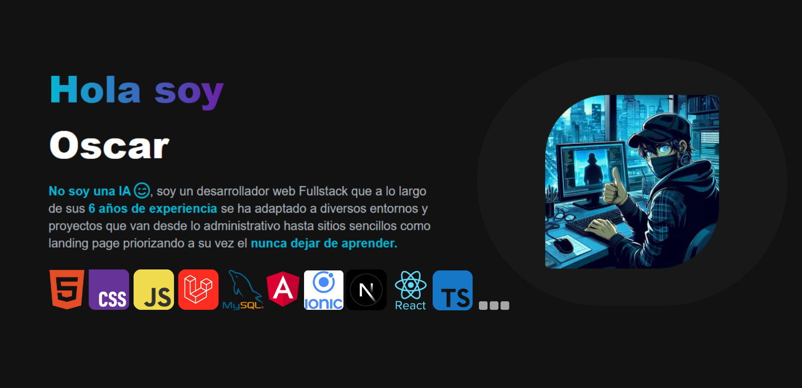

<h1 align="center">Bienvenido a mi Github 👋</h1>

<h2 align="left">Contacto</h2>

<h2 align="left">Tecnologías</h2>

Etc...

<h2 align="left">Acerca de mi</h2>

<ul align="left" style="width:45%;font-size:18px;">
  <li>🖥️ Actualmente estoy trabajando con Next js, JS, Typescript, Vercel.</li>
  <li>📚 Al mismo tiempo estoy estudiando Flutter, Kotlin, Python.</li>
  <li>🔬 Me gusta experimentar con diferentes tecnologías con el fin de crear diferentes proyectos.</li>
  <li>🖱️ Me gusta trabajar con arquitectura limpia y que evite la mayor cantidad de errores posibles.</li>
  <li>🎉 Fun Fact: Todo el mundo es una IA hasta que complete un captcha 😉</li>
</ul>
